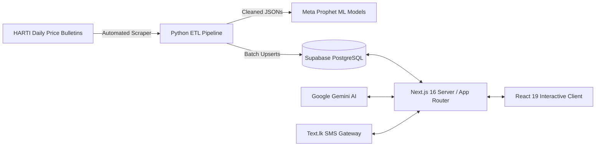

# 🌾 NAMIS — National Agricultural Market Information System
### Sri Lanka's Intelligent Agricultural Price Discovery & ML Forecasting Platform

[](https://nextjs.org/)
[](https://react.dev/)
[](https://www.typescriptlang.org/)
[](https://tailwindcss.com/)
[](https://supabase.com/)
[](https://ai.google.dev/)
[](https://facebook.github.io/prophet/)
[](./LICENSE)

> **NAMIS** (also branded as **AgriLanka**) is a digital agriculture and market intelligence platform designed to eliminate information asymmetry, predict commodity price movements, and empower Sri Lankan farmers, wholesale traders, and policymakers with real-time multi-market transparency.

📖 **Looking for full system documentation, database schemas, and architectural specs?**  
👉 Read the comprehensive [**DOCUMENTATION.md**](./docs/DOCUMENTATION.md).

---

## 🌟 Key Features

- 🗺️ **Interactive 3D Sri Lanka Geospatial Map**: Hardware-accelerated 3D map built with Three.js / OGL rendering Sri Lanka’s 7 major Dedicated Economic Centers (DECs).
- 📊 **Real-Time Market Discovery (`/markets`)**: Live wholesale price tickers, market depth distribution, and inter-market price arbitrage comparison between producer regions and urban terminals.
- 📈 **Advanced Analytics Suite (`/analytics`)**: Candlestick, Line, Column, Bar, Histogram, and Scatter plots with moving averages (SMA7, SMA30), historical comparisons, and export tools.
- 🔮 **Meta Prophet ML Price Forecasting**: Automated Bayesian time-series machine learning models generating 30–60 day price forward outlooks with 90% confidence bands (`yhat_lower`, `yhat_upper`).
- 🤖 **AI Agronomist & Market Analyst (`/api/chat`)**: Google Gemini 2.5-powered conversational assistant equipped with Sri Lankan agricultural economics and harvest logistics knowledge.
- 📱 **Two-Factor Authentication & SMS OTP (`/api/send-otp`)**: Phone verification powered by Text.lk SMS Gateway for Sri Lankan numbers (`+947...`).
- 🔐 **Role-Based Admin Control Center (`/admin`)**: Dedicated management portals for Super Admins and Economic Center Market Admins with quick price entry pads and bulk CSV/JSON ingestion.
- 🌐 **Trilingual Interface**: Native support for **English (EN)**, **Sinhala (SI - සිංහල)**, and **Tamil (TA - தமிழ்)**.

---

## 🏛️ System Architecture



---

## 🚀 Quick Start Guide

### 1. Prerequisites
- **Node.js**: `v20.x` or higher
- **pnpm**: `v9.x` (or `npm`)
- **Python**: `v3.10+` (for ETL and ML pipelines)

### 2. Installation

```bash
# Clone the repository
git clone https://github.com/sadewnethsara/Uni-Project-Web.git
cd Uni-Project-Web

# Install dependencies
pnpm install
```

### 3. Environment Configuration

Copy `.env.example` to `.env.local` and populate the required keys:

```bash
NEXT_PUBLIC_SUPABASE_URL="https://your-project.supabase.co"
NEXT_PUBLIC_SUPABASE_ANON_KEY="eyJhbGciOi..."
SUPABASE_SERVICE_ROLE_KEY="eyJhbGciOi..."
GEMINI_API_KEY="AIzaSy..."
TEXT_LK_API_TOKEN="your_text_lk_token"
```

### 4. Running the Development Server

```bash
pnpm dev
```

Visit [http://localhost:3000](http://localhost:3000) in your browser.

---

## 🛠️ Data Pipelines & Machine Learning

For scraping and price forecasting, explore the `scripts/scraper/` directory:

```bash
cd scripts/scraper
python -m venv venv
.\venv\Scripts\activate   # or source venv/bin/activate
pip install -r requirements.txt

# Download bulletins
python download_pdfs.py --years 2025 2026 --output-dir ../../PDFs

# Extract price tables
python batch_process_pdfs_parallel.py --input-dir ../../PDFs --output-dir ../../price_data

# Ingest to database
cd ../..
npx tsx scripts/sync_data.ts

# Generate Prophet forecasts
cd scripts/scraper
python prepare_prophet_data.py --input-dir ../../price_data --output-dir ../../prophet_data
python generate_forecasts.py ../../prophet_data --output ../../forecast_report.html --days 30
```

---

## 📚 Complete Documentation

Please refer to [**DOCUMENTATION.md**](./docs/DOCUMENTATION.md) for:
- Detailed Database Entity-Relationship Diagrams (ERD) & DDL scripts
- API endpoint specifications (`/api/chat`, `/api/send-otp`)
- Authentication and Row Level Security (RLS) policies
- CI/CD GitHub Actions workflow setup
- Production deployment instructions

---

## 📄 License

This project is licensed under the [MIT License](./LICENSE) — see the [LICENSE](./LICENSE) file for details.

Developed for educational, academic, and research purposes under the National Agricultural Market Information System (NAMIS) initiative.
