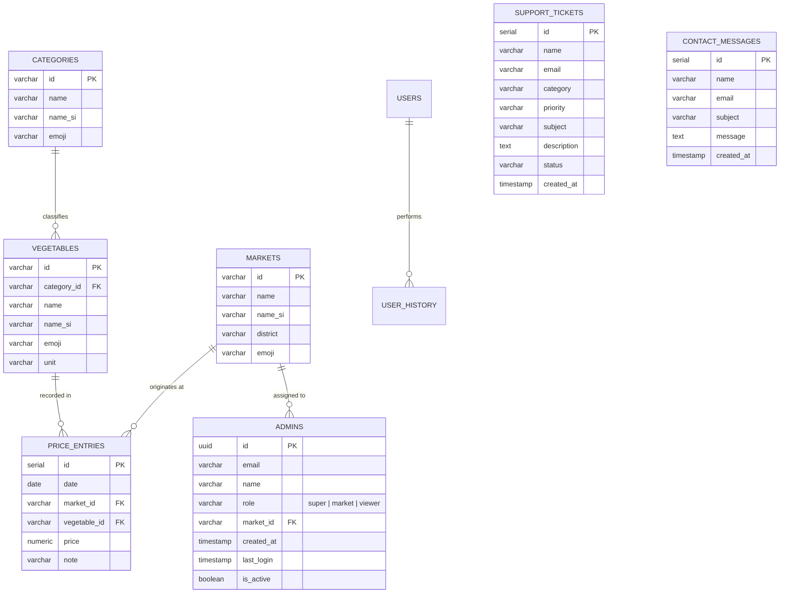
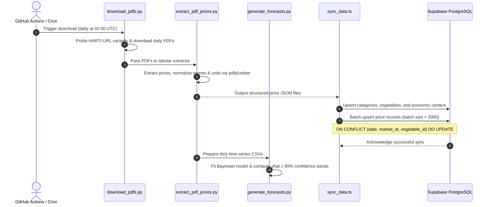

# NAMIS — National Agricultural Market Information System
## Comprehensive System Architecture, Developer Guide, & Operational Documentation

---

### Executive Overview

The **National Agricultural Market Information System (NAMIS)** (also branded as **AgriLanka**) is an enterprise-grade digital agriculture platform designed to resolve information asymmetry, price volatility, and market inefficiencies across Sri Lanka's agricultural supply chain. 

By aggregating daily wholesale price bulletins from national economic centers, applying automated ETL pipelines, running Bayesian time-series machine learning models, and delivering real-time multi-market intelligence through a responsive 3D web experience, NAMIS equips farmers, wholesale traders, agrarian officers, and policymakers with actionable insights.

```mermaid
flowchart TD
    subgraph Data Sources & Ingestion
        A[HARTI Daily Bulletins - harti.gov.lk] -->|Automated Scraping| B[Python PDF Scraper]
        B -->|pdfplumber Extraction| C[Normalized Price JSONs]
        C -->|Feature Prep| D[Prophet Data Preparation]
        D -->|Bayesian Time Series| E[Meta Prophet ML Forecasts]
    end

    subgraph CI/CD & Storage
        C -->|Batch Upsert Script| F[(Supabase PostgreSQL)]
        G[GitHub Actions Daily Cron] -->|02:00 UTC Trigger| B
        G -->|Sync Pipeline| F
    end

    subgraph Core Platform Backend
        F <-->|SSR / RLS / Auth| H[Next.js 16 Server Layer]
        I[Google Gemini 2.5 Flash] <-->|AI Market Analysis| H
        J[Text.lk SMS Gateway] <-->|OTP 2FA Verification| H
    end

    subgraph Client Application Layer
        H <--> K[App Router / React 19]
        K --> L[3D Sri Lanka Map & Showcase]
        K --> M[Market Intelligence Hub /markets]
        K --> N[Deep Analytics Suite /analytics]
        K --> O[Admin Management Portal /admin]
        K --> P[Trilingual Engine EN | SI | TA]
    end
```

---

## 1. System Architecture

NAMIS is architected around a modern decoupled design dividing automated data ingestion, relational cloud storage, server-rendered application routing, and interactive visualization:

### 1.1 Technology Stack Matrix

| Layer | Technology | Version | Purpose |
|---|---|---|---|
| **Frontend Framework** | Next.js (App Router) | 16.2.10 | Server-side rendering (SSR), streaming, route handlers |
| **UI Library** | React | 19.2.4 | Modern reactive component tree with React Compiler |
| **Styling** | Tailwind CSS / PostCSS | v4.0 | Responsive design, modern token-based UI |
| **3D & Visuals** | Three.js / @react-three/fiber / OGL | 0.185.1 | Hardware-accelerated 3D Sri Lanka geographic map |
| **Animation Engine** | Framer Motion | 12.42.2 | Scroll-driven hero reveal, page transitions, sheets |
| **Iconography** | Lucide React / Iconsax | 1.25.0 / 0.0.8 | Consistent agricultural, analytics, and status icons |
| **Database & Auth** | Supabase (PostgreSQL 15+) | 2.112.0 | Relational database, Auth, Row Level Security (RLS) |
| **Database Integration** | @supabase/ssr | 0.12.4 | Cookie-based session validation in Next.js Server Components |
| **AI Intelligence** | Google Gemini (2.5 / 2.0 / 1.5) | REST v1beta | Agronomic advisory and market forecasting intelligence |
| **SMS Gateway** | Text.lk REST API | v3 | Phone number verification & transactional OTPs |
| **ETL & Data Ingestion** | Python / pdfplumber | 3.10+ / 0.11+ | PDF extraction, tabular sanitization, batching |
| **Machine Learning** | Meta Prophet / Pandas | 1.1.5 / 2.0+ | Time-series commodity price trend forecasting |
| **CI/CD Automation** | GitHub Actions | Ubuntu Latest | Scheduled daily data scraping and database sync |

---

## 2. Directory Structure & Codebase Organization

The repository follows a clean, modular structure aligned with the Next.js App Router paradigm:

```
Uni-Project-Web/
├── .github/
│   └── workflows/
│       └── daily_sync.yml            # Automated daily ETL cron workflow
├── public/                           # Static assets, SVG icon library, geo assets
│   ├── icons/                        # 200+ standardized commodity SVG icons
│   └── favicon.ico
├── scripts/
│   ├── scraper/
│   │   ├── download_pdfs.py          # Automated HARTI PDF scraper & downloader
│   │   ├── extract_pdf_prices.py     # Tabular extraction with pdfplumber
│   │   ├── batch_process_pdfs.py     # Batch processing PDFs into JSON
│   │   ├── batch_process_pdfs_parallel.py # Multiprocessing parallel processor
│   │   ├── prepare_prophet_data.py   # Prophet-compatible time series preparation
│   │   ├── generate_forecasts.py     # Meta Prophet forecasting & visual reports
│   │   └── requirements.txt          # Python dependencies for ETL & ML
│   ├── sync_data.ts                  # TypeScript ETL pipeline for Supabase upsert
│   └── generate_icons_data.py        # Icon catalogue compiler
├── src/
│   ├── app/
│   │   ├── (admin)/                  # Route Group: Administrative operations
│   │   │   ├── _components/          # Admin CRUD modals & management panels
│   │   │   ├── admin/page.tsx        # Super Admin / Market Admin dashboard
│   │   │   └── types/                # Admin type interfaces
│   │   ├── (auth)/                   # Route Group: Authentication & Security
│   │   │   ├── login/page.tsx        # User & Admin credentials login
│   │   │   ├── signup/page.tsx       # User registration with SMS OTP verification
│   │   │   └── forgot-password/      # Credential recovery flow
│   │   ├── (main)/                   # Route Group: Primary Application Core
│   │   │   ├── analytics/page.tsx    # Technical charts, multi-market comparison
│   │   │   ├── dashboard/page.tsx    # User activity profile & preferences
│   │   │   └── markets/[[...market]]/page.tsx # Economic Center price discovery
│   │   ├── (public)/                 # Route Group: Informational & Compliance
│   │   │   ├── about-us/page.tsx     # Project mission, stakeholders, methodology
│   │   │   ├── contact/page.tsx      # Contact form with Supabase submission
│   │   │   ├── faq/page.tsx          # Frequently asked questions
│   │   │   ├── privacy/page.tsx      # Data privacy policy
│   │   │   ├── support-desk/page.tsx # Citizen & trader ticketing portal
│   │   │   └── terms/page.tsx        # Terms of service
│   │   ├── api/                      # Server-side API endpoints
│   │   │   ├── chat/route.ts         # Gemini AI Agronomist & Market Analyst
│   │   │   └── send-otp/route.ts     # Text.lk SMS OTP delivery endpoint
│   │   ├── globals.css               # Global CSS & Tailwind v4 styling
│   │   ├── layout.tsx                # Root layout with Auth & Language providers
│   │   └── page.tsx                  # Cinematic 3D landing page & showcase
│   ├── components/                   # Reusable UI components
│   │   ├── analyze/                  # Advanced charting, histogram, scatter plot
│   │   ├── landing/                  # 3D Map, Hero, App showcase, sheet
│   │   ├── market/                   # Price strips, market depth, comparisons
│   │   ├── ui/                       # Buttons, dialogs, dropdowns, calendars
│   │   ├── FloatingChat.tsx          # Global conversational AI assistant drawer
│   │   ├── Header.tsx                # Unified responsive navbar
│   │   └── Footer.tsx                # Standard system footer
│   ├── contexts/
│   │   ├── AuthContext.tsx           # Global user state, session persistence
│   │   └── LanguageContext.tsx       # Trilingual (EN, SI, TA) localization context
│   ├── hooks/
│   │   ├── useAnalyzeDashboard.ts    # Filter synchronization hook
│   │   └── usePageTitle.ts           # Dynamic title mutation
│   ├── lib/
│   │   ├── analyticsData.ts          # Core analytics configuration & constants
│   │   ├── analyticsUtils.ts         # Moving averages, trendlines, aggregation
│   │   ├── iconsData.ts              # Local SVG icon index mapping
│   │   ├── parseAnalyzePrompt.ts     # Natural language query parser (NLP)
│   │   ├── chartTheme.ts             # Charting color palette & tokens
│   │   └── types.ts                  # Shared TypeScript interfaces
│   └── utils/
│       ├── errorHelpers.ts           # Error parsing and formatting
│       └── supabase/
│           ├── client.ts             # Browser-side Supabase client
│           ├── server.ts             # Server-side Supabase client
│           └── middleware.ts         # Edge middleware session handler
├── .env.example                      # Reference environment configuration
├── package.json                      # Node.js project manifest & scripts
├── tsconfig.json                     # TypeScript compiler configuration
└── README.md                         # Public repository overview
```

---

## 3. Database Schema & Data Models

NAMIS runs on a normalized PostgreSQL schema hosted on Supabase, enforcing foreign key integrity, row-level security (RLS), and unique constraints to prevent duplicate entries during batch ingestions.



### 3.1 Table Definitions & DDL Specifications

```sql
-- 1. Categories Table
CREATE TABLE IF NOT EXISTS categories (
    id VARCHAR(100) PRIMARY KEY,
    name VARCHAR(255) NOT NULL,
    name_si VARCHAR(255),
    emoji VARCHAR(20) DEFAULT '📁'
);

-- 2. Commodities / Vegetables Table
CREATE TABLE IF NOT EXISTS vegetables (
    id VARCHAR(100) PRIMARY KEY,
    category_id VARCHAR(100) REFERENCES categories(id) ON DELETE SET NULL,
    name VARCHAR(255) NOT NULL,
    name_si VARCHAR(255),
    emoji VARCHAR(20) DEFAULT '🥬',
    unit VARCHAR(50) DEFAULT 'kg'
);

-- 3. Dedicated Economic Centers (Markets) Table
CREATE TABLE IF NOT EXISTS markets (
    id VARCHAR(100) PRIMARY KEY,
    name VARCHAR(255) NOT NULL,
    name_si VARCHAR(255),
    district VARCHAR(100),
    emoji VARCHAR(20) DEFAULT '🏢'
);

-- 4. Historical Price Entries Table
CREATE TABLE IF NOT EXISTS price_entries (
    id BIGSERIAL PRIMARY KEY,
    date DATE NOT NULL,
    market_id VARCHAR(100) NOT NULL REFERENCES markets(id) ON DELETE CASCADE,
    vegetable_id VARCHAR(100) NOT NULL REFERENCES vegetables(id) ON DELETE CASCADE,
    price NUMERIC(10, 2) NOT NULL,
    note TEXT,
    CONSTRAINT uq_price_entry_date_market_veg UNIQUE (date, market_id, vegetable_id)
);

-- Indexes for lightning-fast lookups
CREATE INDEX IF NOT EXISTS idx_price_entries_date ON price_entries(date DESC);
CREATE INDEX IF NOT EXISTS idx_price_entries_market ON price_entries(market_id);
CREATE INDEX IF NOT EXISTS idx_price_entries_vegetable ON price_entries(vegetable_id);

-- 5. System Administrators Table
CREATE TABLE IF NOT EXISTS admins (
    id UUID PRIMARY KEY REFERENCES auth.users(id) ON DELETE CASCADE,
    email VARCHAR(255) UNIQUE NOT NULL,
    name VARCHAR(255) NOT NULL,
    role VARCHAR(50) NOT NULL CHECK (role IN ('super', 'market', 'viewer')),
    market_id VARCHAR(100) REFERENCES markets(id) ON DELETE SET NULL,
    created_at TIMESTAMPTZ DEFAULT NOW(),
    last_login TIMESTAMPTZ,
    is_active BOOLEAN DEFAULT TRUE
);

-- 6. Support Tickets Table
CREATE TABLE IF NOT EXISTS support_tickets (
    id BIGSERIAL PRIMARY KEY,
    name VARCHAR(255) NOT NULL,
    email VARCHAR(255) NOT NULL,
    category VARCHAR(100) NOT NULL,
    priority VARCHAR(50) NOT NULL,
    subject VARCHAR(255) NOT NULL,
    description TEXT NOT NULL,
    status VARCHAR(50) DEFAULT 'Open',
    created_at TIMESTAMPTZ DEFAULT NOW()
);

-- 7. Contact Inquiries Table
CREATE TABLE IF NOT EXISTS contact_messages (
    id BIGSERIAL PRIMARY KEY,
    name VARCHAR(255) NOT NULL,
    email VARCHAR(255) NOT NULL,
    subject VARCHAR(255) NOT NULL,
    message TEXT NOT NULL,
    created_at TIMESTAMPTZ DEFAULT NOW()
);
```

---

## 4. Data Engineering, Scraping, & Forecasting Pipeline



### 4.1 Step 1: PDF Acquisition (`download_pdfs.py`)
- **Source**: Hector Kobbekaduwa Agrarian Research and Training Institute (HARTI).
- **URL Schema**: `https://www.harti.gov.lk/assets/pdf/food_price/daily/eng/{year}/{folder}/{filename}`.
- **Resilience**: Because HARTI server folder structures periodically deviate (e.g. historical batches dumped under arbitrary month names like "December"), the script uses intelligent candidate heuristics (`FALLBACK_FOLDER_NAMES`), multiple filename formats, and idempotency tracking in `download_log.csv`.

### 4.2 Step 2: Tabular Extraction (`extract_pdf_prices.py` & `batch_process_pdfs.py`)
- Leverages `pdfplumber` to extract clean tables from non-standard government PDF layouts.
- Cleans and normalizes commodity names (e.g., mapping variations of Beans, Carrots, Leeks, Potatoes into canonical keys).
- Extracts `min_price`, `max_price`, and computes `average_price = (min + max) / 2` when not explicitly stated.
- Employs multiprocessing (`batch_process_pdfs_parallel.py`) to process years of historical data in parallel across multi-core CPUs.

### 4.3 Step 3: Bayesian Forecasting with Meta Prophet (`prepare_prophet_data.py` & `generate_forecasts.py`)
- Transforms historical prices into standardized `(ds, y)` time-series format per commodity.
- Fits Facebook Prophet models configured with:
  - 90% uncertainty intervals (`interval_width=0.90`).
  - Additive/multiplicative seasonality detection.
  - Generates 30 to 60-day price forward estimates (`yhat`), upper bound (`yhat_upper`), and lower bound (`yhat_lower`).

### 4.4 Step 4: Supabase Database Synchronization (`sync_data.ts`)
- Automated Node.js/TypeScript pipeline.
- Reads cleaned `price_data/*.json` files.
- Automatically creates non-existent categories, vegetable entries, and markets.
- Ingests prices using batched chunks (2,000 records per transaction) utilizing `onConflict: 'date,market_id,vegetable_id'` to guarantee zero duplicates.

---

## 5. Application Modules & Functional Specifications

### 5.1 Interactive 3D Geographic Visualization (`/`)
- **Technology**: Three.js, `@react-three/fiber`, OGL, Framer Motion.
- **Functionality**:
  - Full 3D rendering of Sri Lanka with accurate geolocations for 7 major Economic Centers:
    1. **Manning Market** (Colombo)
    2. **Dambulla Dedicated Economic Center** (Matale)
    3. **Keppetipola Economic Center** (Badulla)
    4. **Nuwara Eliya Economic Center** (Nuwara Eliya)
    5. **Meegoda Dedicated Economic Center** (Colombo)
    6. **Veyangoda Dedicated Economic Center** (Gampaha)
    7. **Thambuththegama Dedicated Economic Center** (Anuradhapura)
  - Interactive camera angles, hover pins showing live commodity counts, and responsive mobile bottom sheets.

### 5.2 Market Intelligence & Commodity Discovery (`/markets/[[...market]]`)
- **Dynamic Routing**: Supports viewing individual markets (e.g. `/markets/dambulla`, `/markets/manning`) or national aggregate.
- **Price Discovery**: Live wholesale price ticker, price trend indicators (daily change percentage, up/down arrows).
- **Comparison Strip**: Side-by-side price arbitrage comparison between agricultural producer hubs (e.g. Nuwara Eliya, Keppetipola) and consumer terminal hubs (e.g. Manning Market Colombo).
- **Market Depth**: Visual order-book style distribution representing supply density across price brackets.
- **Date Filter**: Interactive single date and multi-day date range selector.

### 5.3 Advanced Technical Analytics Suite (`/analytics`)
- **Chart Styles**:
  - **Candlestick / Advanced Line**: High/Low/Average price action over customizable windows.
  - **Column & Bar Charts**: Volume and cross-market price rankings.
  - **Histogram & Scatter Plot**: Price distribution and volatility clustering.
  - **Historical Comparison**: Year-over-Year (YoY) and Month-over-Month (MoM) overlay.
- **Technical Indicators**: 7-day Simple Moving Average (SMA7), 30-day Moving Average (SMA30), Prophet Machine Learning Forecast Bands.
- **NLP Query Parser (`parseAnalyzePrompt.ts`)**: Enables users to type natural queries such as:
  > *"Compare carrot prices between Dambulla and Manning over the last 14 days"*
  The parser translates natural text into structured state (`commodities: ['carrot'], markets: ['dambulla', 'manning'], timeframe: '14d'`).
- **Reporting**: One-click PNG/PDF export via HTML canvas capture (`captureSection.ts`).

### 5.4 AI Agronomist & Market Analyst (`/api/chat` + `FloatingChat.tsx`)
- Powered by **Google Gemini 2.5 Flash** (with fallback cascade to `gemini-2.0-flash`, `gemini-1.5-flash`).
- Injected with domain-specific knowledge of Sri Lankan economic centers, post-harvest logistics, transport costs, and grade pricing strategies.
- Operates as a persistent floating assistant across all pages.

### 5.5 Two-Factor Authentication & SMS OTP Verification (`/api/send-otp`)
- Integrates with the **Text.lk SMS Gateway** to deliver 6-digit OTP verification codes directly to Sri Lankan mobile numbers (`+947XXXXXXXX`).
- Protects user registrations, sensitive admin access, and prevents bot abuse.

### 5.6 Administrative Control Portal (`/admin`)
- **Role-Based Access Control (RBAC)**:
  - **Super Admin**: Complete CRUD privileges across all markets, user roles, system settings, categories, and audit logs.
  - **Market Admin**: Scoped specifically to their assigned Economic Center (e.g., Dambulla Admin can only add/edit prices for Dambulla).
- **Quick-Add Interface**: Fast numerical pad optimized for market officers recording daily 5:00 AM auction prices from field mobile devices.
- **Data Management**: Bulk import/export of price records via CSV and JSON.

### 5.7 Trilingual Localization Engine (`LanguageContext.tsx`)
- Native support for Sri Lanka's official languages:
  - **English (EN)**
  - **Sinhala (SI - සිංහල)**
  - **Tamil (TA - தமிழ்)**
- Persists user language preference to `localStorage`.
- Dual-field commodity display (`name` and `name_si`) guarantees accessibility for grassroots farmers.

### 5.8 Prescriptive Harvest Timing & "When-to-Plant" Decision Engine
- **Comprehensive Master Blueprint**: Documented in [`docs/HARVEST_OPTIMIZER_PREDICTIVE_SPEC.md`](./HARVEST_OPTIMIZER_PREDICTIVE_SPEC.md).
- **Core Mission**: Transforms NAMIS from reactive historical observation to prescriptive agricultural intelligence, calculating the optimal planting date backwards from predicted peak wholesale prices while maximizing risk-adjusted net profit.
- **Decoupled 8-Model Architecture**: Rather than dumping all variables into one model, NAMIS isolates Yield, Supply, Demand, Quantile Price (P10/P50/P90), Cultivation Cost, Logistics, Risk, and Optimization.
- **Iterative Roadmap**: Governs phased ingestion of 28 domains spanning farm-gate spreads, Dambulla arrival tonnages, weather microclimates, and regional agro-ecological suitability masks.

---

## 6. API Reference & Route Handlers

### 6.1 Chatbot Market Intelligence Endpoint

- **Route**: `POST /api/chat`
- **Headers**: `Content-Type: application/json`
- **Body**:
```json
{
  "messages": [
    { "sender": "user", "text": "What is the price outlook for Carrots at Dambulla this week?" }
  ]
}
```
- **Response**:
```json
{
  "text": "### 🥕 Carrot Price Outlook - Dambulla Economic Center\n\n- **Current Trend**: Stable with minor downward pressure.\n- **Wholesale Range**: Rs. 240.00 - Rs. 280.00 / kg\n- **Recommendation**: Upcountry arrivals from Nuwara Eliya are steady. Early morning trading (4:00 AM - 6:30 AM) commands peak rates for Grade A crates."
}
```

### 6.2 SMS OTP Dispatch Endpoint

- **Route**: `POST /api/send-otp`
- **Headers**: `Content-Type: application/json`
- **Body**:
```json
{
  "recipient": "0771234567",
  "otp": "481923"
}
```
- **Process**:
  1. Validates recipient and OTP existence.
  2. Normalizes phone number to international format: `0771234567` $\rightarrow$ `94771234567`.
  3. Sends authenticated payload to Text.lk Gateway (`https://app.text.lk/api/v3/sms/send`).
- **Response**:
```json
{
  "success": true,
  "data": { "message": "SMS sent successfully." }
}
```

---

## 7. Environment Configuration Guide

Create a `.env.local` file in the project root with the following variables:

```bash
# ==========================================
# Supabase Configuration
# ==========================================
NEXT_PUBLIC_SUPABASE_URL=https://your-project.supabase.co
NEXT_PUBLIC_SUPABASE_ANON_KEY=eyJhbGciOiJIUzI1NiIsInR5cCI...

# Service role key (SERVER ONLY - Used for ETL scripts & Admin operations)
# NEVER expose this key to client-side code!
SUPABASE_SERVICE_ROLE_KEY=eyJhbGciOiJIUzI1NiIsInR5cCI...

# ==========================================
# Google Gemini AI Configuration
# ==========================================
GEMINI_API_KEY=AIzaSy...

# ==========================================
# Text.lk SMS Gateway Configuration
# ==========================================
TEXT_LK_API_TOKEN=your_text_lk_bearer_token_here

# ==========================================
# Optional App Settings
# ==========================================
NEXT_PUBLIC_APP_URL=http://localhost:3000
```

---

## 8. Local Setup & Installation

### 8.1 Prerequisites
- **Node.js**: `v20.x` or higher
- **pnpm**: `v9.x` or higher (recommended) or `npm`
- **Python**: `v3.10` or higher (for ETL scraping & ML forecasting)
- **Git**

### 8.2 Installation Steps

1. **Clone the Repository**:
   ```bash
   git clone https://github.com/sadewnethsara/Uni-Project-Web.git
   cd Uni-Project-Web
   ```

2. **Install Node Dependencies**:
   ```bash
   pnpm install
   # or
   npm install
   ```

3. **Configure Environment Variables**:
   ```bash
   cp .env.example .env.local
   # Fill in your Supabase, Gemini, and Text.lk credentials
   ```

4. **Initialize Database Tables**:
   - Open your **Supabase Dashboard** $\rightarrow$ **SQL Editor**.
   - Copy and execute the DDL queries provided in [Section 3.1](#31-table-definitions--ddl-specifications).

5. **Run the Development Server**:
   ```bash
   pnpm dev
   # or
   npm run dev
   ```
   Open [http://localhost:3000](http://localhost:3000) to view the application.

---

## 9. Running Data Pipelines & ML Forecasting

### 9.1 Setup Python Virtual Environment

```bash
cd scripts/scraper
python -m venv venv

# Windows PowerShell:
.\venv\Scripts\Activate.ps1

# Linux / macOS:
source venv/bin/activate

# Install Python requirements
pip install -r requirements.txt
```

### 9.2 Running Data Ingestion & Forecasts

1. **Scrape Daily PDFs from HARTI**:
   ```bash
   python download_pdfs.py --years 2025 2026 --output-dir ../../PDFs
   ```

2. **Extract Prices into JSON**:
   ```bash
   python batch_process_pdfs_parallel.py --input-dir ../../PDFs --output-dir ../../price_data
   ```

3. **Sync Extracted Prices to Supabase**:
   ```bash
   # From the project root:
   npx tsx scripts/sync_data.ts
   ```

4. **Generate Prophet Price Forecasts**:
   ```bash
   python prepare_prophet_data.py --input-dir ../../price_data --output-dir ../../prophet_data
   python generate_forecasts.py ../../prophet_data --output ../../forecast_report.html --days 30
   ```

---

## 10. Automated CI/CD Workflows

The repository includes an automated GitHub Action located at `.github/workflows/daily_sync.yml`:
- **Trigger**: Daily cron schedule at `02:00 UTC` and manual trigger (`workflow_dispatch`).
- **Function**:
  1. Clones the source dataset.
  2. Sets up Python 3.10 and installs the Supabase client.
  3. Executes the automated ETL ingestion script.
  4. Upserts fresh prices directly into the production Supabase database.

---

## 11. Security & Access Control

1. **Supabase Row Level Security (RLS)**:
   - Tables such as `admins`, `support_tickets`, and `contact_messages` have strict RLS policies enabled.
   - Public read access is granted to `categories`, `vegetables`, `markets`, and `price_entries` for consumer discovery.
   - Insert and update permissions on `price_entries` are restricted exclusively to authenticated administrators with verified roles.
2. **Key Isolation**:
   - `NEXT_PUBLIC_SUPABASE_ANON_KEY` is client-safe and bounded by RLS.
   - `SUPABASE_SERVICE_ROLE_KEY` is restricted strictly to backend scripts (`sync_data.ts`) and server route handlers.
3. **Input Sanitization**:
   - Natural language queries, phone numbers, and contact forms undergo regex validation and normalization before database interaction.

---

## 12. Troubleshooting & FAQ

#### Q1: Why does `sync_data.ts` fail with "Directory not found: price_data"?
**A**: You must run the Python extraction step first (`batch_process_pdfs.py`) to generate the JSON files from the raw PDFs before executing the TypeScript database synchronizer.

#### Q2: What causes `duplicate key value violates unique constraint` on price insertion?
**A**: Ensure your table possesses the composite unique constraint `UNIQUE (date, market_id, vegetable_id)`. The sync script uses `onConflict: 'date,market_id,vegetable_id'` which requires this unique index to successfully convert inserts into updates.

#### Q3: Why are SMS OTP messages failing to send?
**A**: Check that `TEXT_LK_API_TOKEN` is properly configured in `.env.local` and that the destination phone number is a valid 9 or 10-digit Sri Lankan mobile number starting with `07` or `947`.

---

## 13. System Maintenance & Contribution Guide

- **Code Quality**: Follow standard TypeScript strict mode guidelines. Run `pnpm lint` before pushing commits.
- **Component Design**: Keep UI components modular, accessible, and style using Tailwind CSS design tokens defined in `src/app/globals.css`.
- **Database Migrations**: When updating database structures, record changes in explicit SQL migration scripts and verify backwards compatibility with the TypeScript interfaces in `src/lib/types.ts`.

## 14. License

This project is open-source software licensed under the [MIT License](./LICENSE).

---
*NAMIS (National Agricultural Market Information System) — Engineered for Sri Lanka's Agricultural Renaissance.*
