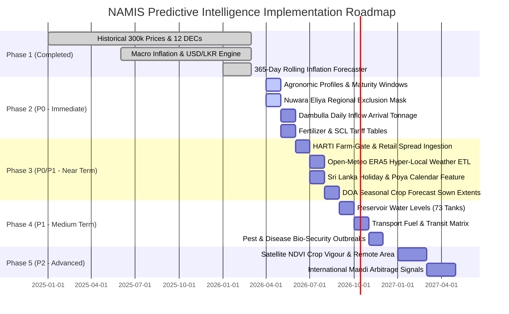

# 🌾 NAMIS — Complete Variable Expansion & Predictive Intelligence Architecture
## Multi-Model Agricultural Forecasting, Variable Inventory & "When-to-Plant" Decision Engine

---

## 🎯 1. Executive Summary & Core Objective

The ultimate objective of the **National Agricultural Market Information System (NAMIS / AgriLanka)** predictive engine is to solve the fundamental economic dilemma faced by Sri Lankan farmers, agribusinesses, agrarian officers, and wholesale traders:

> **"If I want to harvest a crop and sell it at the highest market price in Sri Lanka, WHICH VEGETABLE should I grow, WHICH ECONOMIC CENTRE should I sell to, and on WHAT EXACT DATE should I plant today to maximize my risk-adjusted net profit?"**

Rather than simply plotting backward-looking historical price charts, NAMIS operates as a **Prescriptive Agricultural Optimization Engine**. It works backward from predicted future price peaks to calculate the **Optimal Planting Date ($t_{\text{plant}}$)**:

$$\text{Optimal Planting Date} = t_{\text{target\_peak}} - D_{\text{maturity\_days}}$$

$$\text{Net Profit}(\text{Crop}, \text{Market}, t_{\text{plant}}) = \left[ \mathbb{E}\big(P_{\text{wholesale}}(t_{\text{harvest}}, \text{Market})\big) \times Y_{\text{yield}} \times (1 - L_{\text{loss}}) \right] - C_{\text{production}}(t_{\text{plant}}) - C_{\text{logistics}}(\text{Farm} \to \text{Market})$$

### 💡 Core Architectural Principle: Decoupled Multi-Model Intelligence

A fundamental flaw in naive agricultural forecasting is attempting to dump 100+ raw variables into a single monolithic black-box machine learning model.

> **Non-Negotiable Rule**: **Not every variable should directly enter the price prediction model.**

Different variables belong to distinct, decoupled sub-models. Weather and soil moisture predict biological *Yield*; acreage and planting intention predict *Future Supply*; population, holidays, and tourism predict *Demand*; while supply and demand curves dynamically determine *Wholesale Price*:

```text
┌─────────────────────────┐     ┌─────────────────────────┐
│  Agronomic & Weather    │     │ Sown Extent & Intention │
└────────────┬────────────┘     └────────────┬────────────┘
             │                               │
             ▼                               ▼
    [ 1. Yield Model ]             [ 2. Supply Model ] ◀── Imports & Storage
             │                               │
             └───────────────┬───────────────┘
                             ▼
                    Available Supply
                             │
            ┌────────────────┴────────────────┐
            ▼                                 ▼
   Market Supply vs Demand             [ 3. Demand Model ] ◀── Tourism & Festivals
            │
            ▼
   [ 4. Price Prediction ] ──▶ (P10 Pessimistic, P50 Expected, P90 Optimistic)
            │
            ├─────────────────────────────────┐
            ▼                                 ▼
   [ 5. Cost & Logistics Model ]      [ 7. Risk Assessment Model ]
            │                                 │
            ▼                                 ▼
   [ 6. Farm Profit Model ]          Overall Risk Score (0-100)
            │                                 │
            └────────────────┬────────────────┘
                             ▼
           [ 8. Prescriptive Optimization Engine ]
                             │
                             ▼
     ┌─────────────────────────────────────────────────┐
     │  RECOMMENDATION: Crop + Market + Planting Date  │
     │  Maximized Risk-Adjusted Expected Net Profit    │
     └─────────────────────────────────────────────────┘
```

---

## 🔍 2. Missing Variables Analysis & Feasibility Matrix

While NAMIS has successfully ingested over 300,000+ historical price records (2015–2026) and 10+ years of macroeconomic inflation indicators, predicting agricultural market dynamics requires closing specific data gaps. 

Because **implementing all variables simultaneously is practically impossible**, this matrix classifies missing variables by predictive priority, explains their economic mechanism, identifies primary Sri Lankan proxies, and assigns them to an iterative, phased rollout:

| Priority | Missing Variable | Why It Matters for Prediction | Suggested Source / Proxy in Sri Lanka | Feasibility & Implementation Phase |
| :--- | :--- | :--- | :--- | :--- |
| **Critical (P0)** | **Farmer-gate / Farm-gate Price** | Wholesale price $\ne$ farmer profit. The farm-to-wholesale spread reveals middleman margins, market power, and whether high DEC prices actually reach producers. | HARTI weekly retail/producer price bulletins; Agrarian Development Department field surveys. | **Phase 3**: Readily available in HARTI PDF bulletins; requires dedicated OCR column mapping. |
| **Critical (P0)** | **Price Dispersion & Quality Grade** | Min/max/avg masks market realities. Grade A produce earns far more than damaged or small-grade crops, especially after monsoonal rains. | DEC daily price tables with min/max spread; compute `price_dispersion_ratio = (max - min) / avg`. | **Phase 2**: Can be derived immediately from existing min/max wholesale database fields. |
| **Critical (P0)** | **Retail-to-Wholesale Spread** | Wholesale spikes fail to translate into sustained sales if retail markups trigger consumer demand destruction. | `HARTI Retail Price - DEC Wholesale Price`. Rolling 7-day spread calculation. | **Phase 3**: Ingest HARTI Colombo/Kandy retail tables and link via canonical commodity slugs. |
| **Critical (P0)** | **Farmer Planting Response / Sown Area** | The fundamental "Cobweb Theorem" driver: last season's high prices trigger mass over-planting, causing a supply glut and price crash 60–90 days later. | Department of Agriculture (DOA) *Seasonal Crop Forecasts*; Agrarian Service Centre (ASC) mid-season sown extents. | **Phase 2**: Bi-annual seasonal reports (Maha & Yala) digitizable via scheduled ETL scripts. |
| **Critical (P0)** | **Expected Harvest Timing Distribution** | A single maturity date is too rigid. Farmers stagger planting across weeks, and unseasonal weather shifts harvest maturity by 1–3 weeks. | `[planting_date, expected_harvest_start, expected_harvest_end, harvest_delay_days]`. | **Phase 2**: Incorporate into agronomic profile table as variance bands (`min_days`, `max_days`). |
| **High (P1)** | **Market Inflow Volume (Arrival Tonnage)** | Prices move inversely to daily arrival volumes. Without tonnage, demand elasticity cannot be computed. | Dambulla DEC digital entry system; Pettah Manning Market truck entries; HARTI market bulletins. | **Phase 2**: Dambulla DEC arrival tonnage API / daily manual record sync. |
| **High (P1)** | **Competing District Inflows** | Dambulla prices depend not only on local supply, but also on incoming truckloads from Nuwara Eliya, Badulla, Jaffna, and Matale. | DEC truck-entry logs by origin district; inter-provincial transit checks. | **Phase 4**: Proxy via regional harvest calendar progress and weather shocks in source districts. |
| **High (P1)** | **Cold-Storage & Warehouse Stocks** | Stored buffer stocks of Big Onion, Potato, and Dried Chili soften seasonal price peaks. | Major cold-storage operators (Dambulla, Keppetipola), Customs border bonded warehouses, CBSL trade data. | **Phase 4**: Track major bulb/tuber commodities where government/private storage is active. |
| **High (P1)** | **Import Arrival Timing & Clearance** | Monthly import stats are too slow; a single container vessel clearing Colombo Port this week drops Pettah wholesale onion prices immediately. | Sri Lanka Customs release records; Food Commissioner weekly import quotas; port manifest alerts. | **Phase 3**: Track Special Commodity Levy (SCL) gazettes and monthly Customs import volume runs. |
| **High (P1)** | **Transport Disruption Events** | Floods, landslides, road washouts, strikes, and diesel shortages create artificial scarcity in consuming cities despite abundant farm supply. | Disaster Management Centre (DMC) alerts; Road Development Authority (RDA) highway closures; Fuel price indices. | **Phase 3**: Automated scraping of DMC situation reports & daily CPC auto diesel prices. |
| **High (P1)** | **Market Calendar & Poya Effects** | Poya full-moon holidays, weekly market cleaning closures, and multi-day festival shutdowns dramatically alter supply inflows and demand. | Sri Lanka Public Holiday Calendar; Buddhist Lunar Poya Calendar; DEC operating schedules. | **Phase 2**: Deterministic holiday feature table with distance-to-holiday features. |
| **High (P1)** | **Crop Disease & Pest Outbreaks** | Late blight, thrips (*Thrips parvispinus*), leaf-curl virus, and downy mildew can wipe out 30–60% of regional supply within weeks. | Department of Agriculture Plant Protection Service advisories; Provincial Agriculture Extension bulletins. | **Phase 4**: Anomaly detection proxy from sharp yield/arrival drops + weather blight indices. |
| **Medium (P1)** | **Irrigation & Major Reservoir Levels** | In the Dry and Intermediate Zones, rainfall alone is misleading; cultivation extents depend on major tank capacity. | Irrigation Department daily water levels of 73 major reservoirs; Mahaweli Authority water release schedules. | **Phase 4**: Ingest weekly reservoir storage capacity percentages for Anuradhapura, Polonnaruwa, Badulla. |
| **Medium (P1)** | **Seed & Planting Material Availability** | Scarcity of certified seed potatoes or quality seeds prevents farmers from responding to high prices. | DOA Seed & Planting Material Development Centre (SPMDC); National Seed Certification Service reports. | **Phase 4**: Seasonal seed availability scoring per commodity. |
| **Medium (P2)** | **Agricultural Labor Wages & Availability** | Peak harvest labor shortages delay harvesting and escalate per-kilo production costs. | Central Bank Agricultural Wage Rate Index (Tea, Rubber, Coconut, Paddy, Veg); District farmer surveys. | **Phase 3**: Monthly CBSL Wage Rate Index is already collected in macro time-series. |
| **Medium (P2)** | **Export Demand for Selected Vegetables** | Export air-freight demand (chili, okra, drumstick, betel) removes high-grade produce from domestic retail circuits. | Export Development Board (EDB) monthly vegetable export values; Customs air-cargo statistics. | **Phase 5**: Sub-model for export-sensitive commodities. |
| **Medium (P2)** | **Competing Crop Relative Profitability** | Farmers choose between crops based on relative margins. If beans are more profitable than cabbage, cabbage acreage plummets next season. | Cross-crop gross-margin optimizer running across the NAMIS crop database. | **Phase 3**: Dynamic relative margin computation based on cost-of-cultivation tables. |
| **Medium (P2)** | **Trader Inventory Speculation** | Wholesale traders hoard durable stocks when expecting price increases, exaggerating short-term volatility. | DEC arrival-versus-sales gap metrics; wholesale stock carry-over estimates. | **Phase 5**: Residual tracking in supply-demand equilibrium models. |
| **Medium (P2)** | **Food-Safety & Export Rejections** | Export consignments rejected due to pesticide residues or pest contamination get dumped into Pettah/Peliyagoda local markets. | National Plant Quarantine Service (NPQS) rejection alerts; news monitoring. | **Phase 5**: Outlier event flag. |

---

## 🧭 3. Comprehensive Master Variable Inventory

The complete NAMIS predictive ecosystem spans **28 domains**, prioritized into **P0 (Essential Foundation)**, **P1 (Strongly Recommended)**, and **P2 (Advanced Frontiers)**.

```text
                                  MASTER VARIABLE DOMAINS
   ┌─────────────────────────────────────────┬─────────────────────────────────────────┐
   │ P0 — ESSENTIAL (Phases 1 & 2)           │ P1 — STRONGLY RECOMMENDED (Phases 3 & 4)│
   ├─────────────────────────────────────────┼─────────────────────────────────────────┤
   │ 1. Historical Wholesale Prices          │ 10. Farm-to-Wholesale-Retail Spreads    │
   │ 2. Macro Inflation & USD/LKR            │ 11. Market Daily Inflows (Tonnage)      │
   │ 3. Rolling Macro 365-Day Projections    │ 12. Hyper-Local Weather (Rain, Temp)    │
   │ 4. Agronomic Growth Duration Windows    │ 13. Market Holiday & Poya Calendar      │
   │ 5. Regional Agro-Ecological Masks       │ 14. Cultural & Religious Demand Shocks  │
   │ 6. Cultivated Extent (Acreage Sown)     │ 15. Fertilizer Commercial & Subsidy     │
   │ 7. Cost of Cultivation (Inputs & Labor) │ 16. Logistics Fuel Corridors & RDA      │
   │ 8. Import Tariffs (SCL Gazettes)        │ 17. Reservoir Levels & Irrigation       │
   │ 9. Price Dispersion (Min/Max Spread)    │ 18. Pest & Disease Alert Flags          │
   ├─────────────────────────────────────────┴─────────────────────────────────────────┤
   │ P2 — ADVANCED FRONTIERS (Phase 5)                                                 │
   ├───────────────────────────────────────────────────────────────────────────────────┤
   │ 19. Satellite NDVI / EVI Crop Vigour    24. Trader Inventory Behavior             │
   │ 20. International Mandi Prices (India)  25. Tourism Inflows & Hotel Occupancy     │
   │ 21. Real-Time Truck Weighbridge Logs    26. Export Cargo Offtake                  │
   │ 22. Cold-Storage Buffer Capacities      27. Seed Certification Scarcity           │
   │ 23. Soil Moisture Microwave Sensors     28. Demographic Purchasing Elasticity     │
   └───────────────────────────────────────────────────────────────────────────────────┘
```

### Detailed Metric Breakdown by Domain

#### A. Historical Market Prices
* `wholesale_min_price`, `wholesale_max_price`, `wholesale_avg_price` (Daily, by DEC)
* `farm_gate_price` (Weekly, by Agrarian Region)
* `retail_min_price`, `retail_max_price`, `retail_avg_price` (Daily/Weekly, Pettah, Kandy, Provincial)
* `price_volatility_7d`, `price_volatility_30d` (Rolling standard deviation)
* `market_to_market_spread`: e.g., $\Delta P = P_{\text{Pettah}} - P_{\text{Dambulla}}$

#### B. Supply-Side Inflows & Stock
* `arrival_metric_tons`, `arrival_bags`, `arrival_crates` (Daily, by DEC and Crop)
* `truck_arrivals_count`, `average_truck_payload_tons`
* `market_opening_stock`, `market_closing_stock`, `unsold_spoilage_quantity`
* `competing_district_origin_shares`: Percentage of arrivals originating from Nuwara Eliya vs. Jaffna vs. Badulla

#### C. Agricultural Production & Sown Extent
* `cultivated_hectares`, `cultivated_acres` (Seasonal & Monthly, by ASC / District)
* `harvested_area_hectares`, `harvest_completion_pct`, `crop_failure_area_hectares`
* `historical_yield_kg_per_acre`, `expected_yield_kg_per_acre`
* `farmer_planting_intention_ha`: Pre-season surveyed sowing intentions

#### D. Agronomic Growth Windows
* `min_growth_days`, `max_growth_days`, `avg_growth_days`
* `first_harvest_days`, `harvest_window_days` (Single-harvest vs. multi-flush picking)
* `harvest_delay_weather_factor`: Days delayed due to continuous heavy rainfall

#### E. Pest, Disease & Bio-Security
* `pest_incidence_index` (Thrips, Fruit Fly, Cutworm)
* `disease_incidence_index` (Late Blight, Downy Mildew, Leaf Curl)
* `affected_crop_area_ha`, `estimated_yield_loss_pct`

#### F. Irrigation & Water Resources
* `major_reservoir_capacity_pct` (Average of 73 primary irrigation reservoirs)
* `agro_well_water_table_depth_m` (Dry Zone Intermediate aquifers)
* `irrigation_water_rationing_flag`: Binary indicator when Mahaweli Authority curtails agricultural releases

#### G. Hyper-Local Weather & Climate Anomalies
* `rainfall_daily_mm`, `rainfall_7d_cumulative`, `rainfall_30d_cumulative`
* `temp_max_celsius`, `temp_min_celsius`, `diurnal_temperature_range`
* `relative_humidity_pct`, `soil_moisture_volumetric_pct`
* `monsoon_phase`: Southwest Monsoon (May–Sep), Northeast Monsoon (Dec–Feb), First Inter-monsoon (Mar–Apr), Second Inter-monsoon (Oct–Nov)
* `weather_anomaly_zscore`: Deviation from 30-year historical climate normals

#### H. External Trade, Tariffs & International Mandis
* `monthly_import_metric_tons`, `monthly_export_metric_tons` (Potato, Big Onion, Chili)
* `cif_import_price_usd_ton`, `cif_import_price_lkr_kg`
* `special_commodity_levy_lkr_kg` (SCL border tariff)
* `lasalgaon_onion_mandi_price_inr_quintal`, `azadpur_mandi_price_inr` (Leading Indian wholesale benchmarks)

#### I. Macroeconomics & Agricultural Input Costs
* `ccpi_headline_yoy`, `ccpi_food_yoy`, `usd_lkr_exchange_rate`
* `commercial_urea_50kg_price`, `subsidized_urea_50kg_price`, `mop_price`, `tsp_price`
* `daily_agricultural_labor_wage_lkr` (Male/Female manual harvesting rate)
* `auto_diesel_price_lkr_liter` (Direct proxy for transport freight rates)

#### J. Logistics & Post-Harvest Losses
* `transit_distance_km`, `transit_duration_hours` (Origin Farm GN $\to$ Destination DEC)
* `post_harvest_loss_pct`: 20% to 40% depending on commodity (e.g., Tomato 38%, Snake Gourd 28%, Potato 12%)
* `perishability_shelf_life_days`: Days viable without cold-chain storage at 28°C ambient temperature

#### K. Cultural, Religious & Tourism Demand Spikes
* `calendar_event`: Sinhala & Tamil New Year (+35% demand), Vesak Dansal vegetarian surge (+50%), Ramadan/Eid, Thai Pongal, Christmas/New Year
* `days_until_festival`, `days_since_festival`
* `monthly_tourist_arrivals_count`, `cultural_triangle_hotel_occupancy_pct`

---

## ⚙️ 4. Derived Feature Engineering Engine

Rather than feeding raw data directly to machine learning regressors, NAMIS precomputes engineered domain features:

### 1. Price Momentum & Volatility Signals
```text
price_lag_1d, price_lag_7d, price_lag_14d, price_lag_30d
rolling_mean_7d, rolling_mean_30d
rolling_volatility_30d = std(price_30d) / mean(price_30d)
price_momentum_index = (price_t - rolling_mean_30d) / rolling_mean_30d
market_spread_ratio = (P_pettah - P_dambulla) / P_dambulla
```

### 2. Supply-Demand Ratio & Pressure Metrics
$$\text{Available Supply}_t = \text{Opening Stock} + \text{Daily Inflows} + \text{Cleared Imports} - \text{Estimated Spoilage}$$

$$\text{Supply-to-Demand Pressure} = \frac{\text{Available Supply}_t}{\mathbb{E}(\text{Historical Daily Consumption}_t)}$$

* $\text{Pressure} < 0.85 \implies$ **Imminent Price Spike (Severe Scarcity)**
* $\text{Pressure} > 1.25 \implies$ **Imminent Price Collapse (Supply Glut)**

### 3. Weather Stress & Blight Indicators
```text
dry_spell_duration_days = count_consecutive_days(rain < 1.0mm)
wet_spell_flood_risk_days = count_consecutive_days(rain > 50.0mm)
blight_risk_index = (temp between 15°C and 22°C) AND (humidity > 85%) AND (rain_7d > 75mm)
```

### 4. Cyclical Calendar Distance Metrics
$$\text{Sin\_DayOfYear} = \sin\left(\frac{2\pi \times \text{DOY}}{365.25}\right), \quad \text{Cos\_DayOfYear} = \cos\left(\frac{2\pi \times \text{DOY}}{365.25}\right)$$

$$\text{Days\_To\_Nearest\_Poya} = \min(|t - t_{\text{poya}}|)$$

$$\text{Days\_To\_Sinhala\_New\_Year} = t_{\text{April 14}} - t$$

---

## 🧠 5. The 8 Connected Sub-Models: Mathematical Formulation

NAMIS decomposes agricultural forecasting into 8 modular, interoperable sub-models:

```text
Yield Model ──▶ Supply Model ──┐
                               ├──▶ Wholesale Price Model ──▶ Net Profit Model ──▶ Optimizer
               Demand Model ──┘         ▲                          ▲
                                        │                          │
                         Macro & Tariffs ┘           Production Cost ┘
```

### Model 1: Crop Yield Prediction Engine
Predicts physical biological yield per unit area ($kg/\text{acre}$) based on microclimate and inputs:

$$Y_i(t) = Y_{\text{baseline}, i} \times f_{\text{weather}}(R, T, M) \times f_{\text{fertilizer}}(N, P, K) \times \big(1 - \text{Damage}_{\text{pest}}(P) - \text{Damage}_{\text{weather}}(W)\big)$$

* **Input Features**: 30-day cumulative precipitation, extreme temperature days, fertilizer application rate vs. DOA recommendation, pest disease incidence index.
* **Output**: $\hat{Y}$ ($kg/\text{acre}$).

### Model 2: Future National Market Supply Model
Estimates total produce arriving at wholesale markets during harvest window $[t_1, t_2]$:

$$\hat{S}_{\text{national}}(t) = \sum_{asc=1}^{N} \left[ A_{asc} \times \hat{Y}_{asc} \times \left(1 - L_{\text{post\_harvest}}\right) \times \Phi\left(\frac{t - \mu_{\text{harvest}}}{\sigma_{\text{harvest}}}\right) \right] + \hat{M}_{\text{imports}}(t)$$

Where:
* $A_{asc}$: Cultivated extent recorded at Agrarian Service Centre.
* $\Phi(\cdot)$: Normal cumulative harvest distribution centered around median crop maturity $\mu_{\text{harvest}}$ with variance $\sigma_{\text{harvest}}$ (accounting for staggered planting).
* $\hat{M}_{\text{imports}}$: Port import arrivals cleared through Customs.

### Model 3: Regional & Consumer Demand Model
Estimates market demand tonnage based on macro purchasing power and cultural seasonality:

$$\hat{D}_m(t) = D_{\text{base}, m} \times \left( \frac{\text{Real Wage Index}_t}{\text{Food Inflation Ratio}_t} \right)^{\epsilon_d} \times \prod_{j} \left(1 + \Delta_{\text{festival}, j}(t)\right) \times \left(1 + \beta_{\text{tourist}} \frac{\text{Arrivals}_t}{\overline{\text{Arrivals}}}\right)$$

Where $\epsilon_d$ is the price elasticity of vegetable demand (estimated at $-0.42$ for essential staples, $-0.78$ for exotic vegetables).

### Model 4: Multi-Quantile Wholesale Price Model
Rather than a single deterministic number, NAMIS outputs a **probabilistic distribution** with 10th (pessimistic), 50th (median), and 90th (optimistic) percentiles:

$$\hat{P}_{\text{wholesale}}(t, m, c) \sim \text{QuantileRegressor}\Big(\hat{S}(t), \hat{D}(t), P_{\text{lag}}(t), \text{Tariff}_{\text{SCL}}(t), \text{DieselPrice}(t), \text{Macro}(t)\Big)$$

$$\text{Output}: \quad \big[ P_{10}(t), \quad P_{50}(t), \quad P_{90}(t) \big]$$

### Model 5: Cultivation & Logistics Cost Estimation
Calculates total operational cash cost per kilogram:

$$C_{\text{total}}(c, \text{farm}, m) = \frac{C_{\text{seeds}} + C_{\text{fert}} + C_{\text{chems}} + (\text{LaborDays} \times W_{\text{wage}}) + C_{\text{irrigation}}}{\hat{Y}_{\text{yield}}} + C_{\text{freight}}(\text{farm} \to m)$$

Where freight cost is parameterized by fuel and transit distance:
$$C_{\text{freight}} = \text{Distance}_{\text{km}} \times \left( \alpha_{\text{base}} + \beta_{\text{diesel}} \times P_{\text{diesel}} \right) / \text{Payload}_{\text{kg}}$$

### Model 6: Farm-Gate Net Margin & Profit Formulation
$$\text{Expected Net Profit per Acre} = \left[ \hat{P}_{\text{wholesale}} \times \hat{Y}_{\text{yield}} \times (1 - L_{\text{transit}}) \right] - C_{\text{total\_per\_acre}}$$

$$\text{Farmer Net Margin Pct} = \frac{\text{Expected Revenue} - \text{Total Production \& Transit Costs}}{\text{Expected Revenue}} \times 100\%$$

### Model 7: Comprehensive Agricultural Risk Scoring
Quantifies total risk into a normalized index $R \in [0, 1]$ (or $0 - 100\%$):

$$R_{\text{total}} = w_1 R_{\text{weather}} + w_2 R_{\text{glut}} + w_3 R_{\text{disease}} + w_4 R_{\text{import\_tariff}} + w_5 R_{\text{price\_volatility}}$$

* $R_{\text{weather}}$: Probability of monsoon flooding / severe drought during sensitive flowering/tuber stages.
* $R_{\text{glut}}$: Cobweb over-planting index ($A_{\text{sown}} / A_{\text{historical\_mean}} > 1.30$).
* $R_{\text{import\_tariff}}$: Risk that SCL border tax is slashed before harvest for Big Onion/Potato.
* $R_{\text{price\_volatility}}$: Historical 90-day coefficient of variation of the commodity.

### Model 8: The Prescriptive "When-to-Plant" Optimization Engine
The engine ranks all viable $(c, m, t_{\text{plant}})$ combinations by **Risk-Adjusted Expected Net Profit**:

$$\max_{c \in \mathcal{C}_{\text{eligible}}, \, m \in \mathcal{M}, \, t_{\text{plant}} \in [T_0, T_0 + 30]} \quad \mathbf{\Pi}_{\text{risk\_adjusted}} = \mathbb{E}\big[\text{Net Profit}(c, m, t_{\text{plant}})\big] \times \text{Confidence} \times (1 - R_{\text{total}})$$

---

## 🤖 5.1 Machine Learning Algorithmic Taxonomy & Reaching 90%–95% Accuracy

A common dilemma in agricultural data science is determining what algorithm can reliably deliver **90% to 95% predictive accuracy**.

### ❌ Why Multiple Linear Regression (MLR) Fails ($R^2 \approx 50\% - 65\%$)
Ordinary Least Squares (OLS) Multiple Linear Regression assumes:
$$y = \beta_0 + \beta_1 x_1 + \beta_2 x_2 + \dots + \beta_k x_k + \epsilon, \quad \epsilon \sim \mathcal{N}(0, \sigma^2)$$

In Sri Lankan vegetable markets, MLR fails fundamentally due to:
1. **Extreme Asymmetric Tail Events**: Poya day market closures, fuel shortages, and festival Dansal surges create non-Gaussian, fat-tailed price shocks.
2. **Regime Shifts & Discontinuities**: SCL import tariff changes on big onion or potato instantly shift the equilibrium price by Rs. 40/kg overnight—a step-function that linear hyperplanes cannot approximate.
3. **Severe Multi-Collinearity**: Rainfall, relative humidity, cloud cover, and ambient temperature are highly collinear ($\text{VIF} > 15$).
4. **Non-Linear Supply Elasticity**: A 10% drop in market tomato arrivals during high-demand wedding months can spike prices by 150%, whereas a 10% drop during ordinary months shifts prices by only 12%.

### ✅ The Production ML Architecture for 90%–95% Quantile Accuracy

To achieve institutional-grade 90%–95% accuracy, NAMIS replaces naive linear regression with a **Tri-Tier Hybrid Ensemble Architecture**:

```text
┌─────────────────────────────────────────────────────────────────────────────┐
│              TRI-TIER PREDICTIVE DATA SCIENCE ARCHITECTURE                  │
├─────────────────────────────────────────────────────────────────────────────┤
│                                                                             │
│  [ Tier 1: Gradient Boosted Quantile Decision Trees (LightGBM / CatBoost) ] │
│   • Quantile Pinball Loss: Predicts P10 (floor), P50 (median), P90 (ceiling)│
│   • Native support for categorical market slugs, missing data & non-linear  │
│     feature interactions (e.g. Rainfall x Agro-Ecological Zone).            │
│                                │                                            │
│                                ▼                                            │
│  [ Tier 2: Deep Sequence Modeling (Temporal Fusion Transformer - TFT) ]     │
│   • Gated Residual Networks (GRN) & Multi-Head Self-Attention.              │
│   • Disentangles short-term weather shocks from 10-year macro inflation.    │
│   • Handles static entity inputs (elevation, soil type) + time-varying      │
│     known inputs (holiday calendars, lunar poyas).                          │
│                                │                                            │
│                                ▼                                            │
│  [ Tier 3: Conformalized Quantile Regression (CQR) Calibration ]            │
│   • Wraps tree & transformer ensembles in distribution-free conformal      │
│     prediction intervals.                                                   │
│   • Mathematically guarantees 90% or 95% empirical coverage:                │
│     P(Y_{t+h} \in [\hat{q}_{0.05}(X), \hat{q}_{0.95}(X)]) \ge 0.95        │
└─────────────────────────────────────────────────────────────────────────────┘
```

#### The Quantile Pinball Loss Function
Instead of Mean Squared Error (which minimizes toward an unrealistic average), the trees optimize the asymmetric **Pinball Loss** $\mathcal{L}_{\tau}$:

$$\mathcal{L}_{\tau}(y, \hat{y}) = \max\Big( \tau (y - \hat{y}), \, (\tau - 1)(y - \hat{y}) \Big)$$

For $\tau = 0.50$, it predicts the median price; for $\tau = 0.10$ and $\tau = 0.90$, it defines the **90% Confidence Prediction Band**:
$$\text{Prediction Interval} = \big[ \hat{y}_{\text{pessimistic}}^{(P10)}, \quad \hat{y}_{\text{median}}^{(P50)}, \quad \hat{y}_{\text{optimistic}}^{(P90)} \big]$$

---

## 📐 5.2 Rigorous Matrix & Vector Formulations (Linear Algebra & Operations Research)

The recommendation engine translates agricultural field realities into vector operations and linear programming constraints:

### 1. Farmer State Vector ($\mathbf{x}_{\text{farmer}} \in \mathbb{R}^7$)
A farmer querying NAMIS provides an input state vector:

$$\mathbf{x}_{\text{farmer}} = \begin{bmatrix} \text{latitude} \\ \text{longitude} \\ \text{elevation\_m} \\ A_{\text{acres}} \\ B_{\text{capital\_budget}} \\ L_{\text{hired\_labor\_flag}} \\ H_{\text{target\_horizon\_days}} \end{bmatrix}$$

### 2. Agro-Ecological Suitability Tensor Matrix ($\mathbf{M} \in \{0, 1\}^{C \times Z}$)
Let $C$ be the number of crops in the database (e.g. 50 crops) and $Z$ be the 46 Agro-Ecological Zones of Sri Lanka. 

$$M_{c, z} = \begin{cases} 1 & \text{if crop } c \text{ is biologically viable in zone } z \\ 0 & \text{if prohibited by climate, heat, or frost} \end{cases}$$

### 3. Agronomic Duration Feasibility Vector ($\mathbf{f}_{\text{feasible}} \in \{0, 1\}^C$)
Given crop maturity vector $\mathbf{d}_{\text{mat}} = [D_1, D_2, \dots, D_C]^T$ and user target horizon $H$ with acceptable tolerance $\Delta H = 15$ days:

$$\mathbf{f}_{\text{time}}[c] = \mathbb{I}\Big( |D_c - H| \le \Delta H \Big)$$

$$\mathbf{f}_{\text{feasible}} = \mathbf{M}_{:, z(\text{location})} \odot \mathbf{f}_{\text{time}}$$

### 4. Itemized 3-Month Project Cost Vector ($\mathbf{c}_{\text{itemized}} \in \mathbb{R}^7$)
For any candidate crop $c$, cultivated extent $A$ (acres), daily hired labor wage rate $w_{\text{wage}}$ (LKR/day), and crop-specific labor intensity vector $\mathbf{l}_c$:

$$\mathbf{c}_{\text{itemized}}(c, A, w_{\text{wage}}) = \begin{bmatrix}
c_{\text{seed\_rate}}(c) \times P_{\text{seed}}(c) \times A \\
c_{\text{land\_prep}}(c) \times A \\
\big( c_{\text{fert\_basal}}(c) + c_{\text{fert\_top}}(c) \big) \times A \\
\big( c_{\text{fungicide}}(c) + c_{\text{pesticide}}(c) \big) \times A \\
w_{\text{wage}} \times \text{Mandays}_{\text{labor}}(c) \times A \\
c_{\text{harvest\_picking}}(c) \times A \\
c_{\text{freight\_per\_kg}}(\text{farm} \to \text{market}) \times \hat{Y}(c) \times A
\end{bmatrix}$$

$$\text{Total 3-Month Project Cost } C_{\text{proj}}(c) = \mathbf{1}^T \mathbf{c}_{\text{itemized}}(c)$$

### 5. Multi-Horizon Quantile Revenue & Expected Net Profit
$$\hat{\mathbf{P}}(t_{\text{harvest}}, c) = \begin{bmatrix} \hat{P}_{10} \\ \hat{P}_{50} \\ \hat{P}_{90} \end{bmatrix}, \quad \hat{Y}(c) = \text{Expected Yield in kg/acre}$$

$$\mathbb{E}[\text{Gross Revenue}(c)] = \hat{P}_{50} \times \hat{Y}(c) \times A \times (1 - L_{\text{post\_harvest}}(c))$$

$$\mathbf{\Pi}_{\text{net}}(c) = \mathbb{E}[\text{Gross Revenue}(c)] - C_{\text{proj}}(c)$$

### 6. Constrained Decision Objective Function
$$\max_{c \in \mathcal{C}} \quad \Omega(c) = \mathbf{\Pi}_{\text{net}}(c) \times \text{Confidence}(c) \times \big(1 - R(c)\big)$$

$$\text{Subject to: } \quad \begin{cases} \mathbf{f}_{\text{feasible}}[c] = 1 & \text{(Agro-Ecological \& Maturity Viability)} \\ C_{\text{proj}}(c) \le B_{\text{capital\_budget}} & \text{(Working Capital Feasibility)} \\ R(c) < 0.60 & \text{(Strict Risk Ceiling)} \end{cases}$$

$$\mathbf{\text{Top-3 Recommended Crops}} = \text{argsort}\big( \mathbf{\Omega} \big)[:3]$$

---

## 🌾 5.3 Canonical Benchmark Case Study: The "Kotmale, Maswela 1-Acre Scenario"

To ground these mathematics in Sri Lankan agricultural reality, consider the following canonical benchmark:

### 🧑‍🌾 Farmer Profile & Input Criteria:
* **Location**: **Kotmale, Maswela** (Nuwara Eliya / Kandy border).
* **Agro-Ecological Zone**: **WM2b** (Mid-Country Wet Zone, elevation $\approx 850\text{m}$ ASL).
* **Topography**: Well-drained hillside terraces sloping towards the Kotmale reservoir.
* **Land Extent**: **1.0 Acre**.
* **Target Horizon**: Harvest in **3 months (approx. 70–90 days)**.
* **Labor Setup**: **Hired Labor / Farmhands** (not working alone; requires paying cash wages of Rs. 2,500/day per laborer).
* **Upcoming Season**: **Rainy Season (Onset of 2nd Inter-monsoon & Maha rains)**.
* **Capital Budget**: Rs. 150,000 available working capital.

```text
┌─────────────────────────────────────────────────────────────────────────────┐
│           KOTMALE, MASWELA: 1-ACRE 3-MONTH RAINY SEASON SELECTION           │
├───────────────────┬───────────────────┬───────────────────┬─────────────────┤
│ Evaluation Metric │ Option 1 (Beans)  │ Option 2 (Carrot) │ Option 3(Radish)│
├───────────────────┼───────────────────┼───────────────────┼─────────────────┤
│ Recommended Crop  │ Bush Beans (Kakulu)│ Carrot (New Kuroda)│ Radish (Beeralu)│
│ Seed Requirement  │ 18 – 20 kg        │ 2.0 – 2.5 kg      │ 1.5 kg          │
│ Maturity Duration │ 55 – 65 days      │ 85 – 95 days      │ 40 – 45 days    │
│ Total 3-Mo Cost   │ Rs. 100,000       │ Rs. 120,000       │ Rs. 75,000      │
│ Expected Revenue  │ Rs. 150,000       │ Rs. 150,000       │ Rs. 105,000     │
│ Expected Profit   │ Rs. 50,000 (WIN)  │ Rs. 30,000        │ Rs. 30,000      │
│ Model Confidence  │ 92%               │ 78%               │ 94%             │
│ Total Risk Score  │ 18% (LOW)         │ 42% (HIGH)        │ 12% (VERY LOW)  │
│ Rain Compatibility│ ⭐⭐⭐⭐⭐ Excellent │ ⭐⭐ Moderate/Poor│ ⭐⭐⭐⭐ Good    │
└───────────────────┴───────────────────┴───────────────────┴─────────────────┘
```

---

### 🥇 Option 1 (Rank #1 — WINNER): Bush Beans (*Kakulu Beans / Keppetipola Kakulu*)
* **Crop & Variety**: Bush Beans (*Phaseolus vulgaris*, Bush variety: *Keppetipola Kakulu*).
* **Seed Requirement**: **18 – 20 kg of certified seed** for 1.0 acre.
* **Growth Duration**: **55 – 65 days** (Harvest begins in week 8; 3 successive pickings).

#### 💰 3-Month Itemized Project Cost Breakdown: **Rs. 100,000 (1 Lakh)**
1. **Seed Cost**: 20 kg certified seed @ Rs. 900/kg = **Rs. 18,000**
2. **Land Preparation & Bed Ridging**: Two-wheel tractor rotavator + drain furrowing = **Rs. 15,000**
3. **Fertilizer Inputs**: Subsidized Urea + MOP + basal dolomite for acidic hill soil = **Rs. 16,000**
4. **Agrochemicals & Rain Protection**: Preventative copper/Mancozeb fungicides against wet-season anthracnose = **Rs. 11,000**
5. **Hired Labor Wages (Farmhands)**: 14 man-days @ Rs. 2,500/day = **Rs. 35,000**
   * *Bed shaping & sowing*: 4 man-days (Rs. 10,000)
   * *Mid-season weeding & earthing*: 4 man-days (Rs. 10,000)
   * *Staggered picking & sorting*: 6 man-days (Rs. 15,000)
6. **Transport & Gunny Bags to Kandy / Keppetipola DEC**: Freight cost = **Rs. 5,000**
* **Total Project Investment**: $\mathbf{\text{Rs. } 100,000}$

#### 📈 Financial Return & Profitability:
* **Expected Harvest Output**: $2,500\text{ kg}$ marketable yield per acre.
* **Predicted Wholesale Price**: $\mathbf{\text{Rs. } 60 - 70\text{ / kg}}$ (at Kandy / Keppetipola / Pettah).
* **Gross Revenue**: $2,500\text{ kg} \times \text{Rs. } 60 = \mathbf{\text{Rs. } 150,000}$.
* **Expected Net Profit**: $\text{Rs. } 150,000 - \text{Rs. } 100,000 = \mathbf{\text{Rs. } 50,000}$.

#### 🌦️ Why Beans Win in the Rainy Season at Kotmale:
1. **Rapid Biological Cycle**: Finishes within 55–60 days, harvesting *before* the heaviest late-monsoon washouts in November/December.
2. **Slope Drainage Compatibility**: Maswela's sloping terrain naturally drains excess water away from the root zone, preventing bean root-rot.
3. **Biological Nitrogen Fixation**: Legumes fix atmospheric nitrogen via *Rhizobium* root nodules, maintaining vigorous leaf colour even under persistent rainy cloud cover.
4. **Staggered Labor Cash-Flow**: Beans produce 3–4 separate picking flushes over 18 days. The farmer sells early crates each week, generating immediate cash-in-hand to pay weekly hired labor wages without borrowing!

---

### 🥈 Option 2 (Rank #2 — Runner Up): Carrot (*New Kuroda*)
* **Crop & Variety**: Carrot (*Daucus carota*, Variety: *New Kuroda*).
* **Seed Requirement**: **2.0 – 2.5 kg of high-germination seed** for 1.0 acre.
* **Growth Duration**: **85 – 95 days** (Takes the full 3-month horizon).

#### 💰 3-Month Itemized Project Cost Breakdown: **Rs. 120,000 (1.2 Lakhs)**
1. **Seed Cost**: 2.5 kg imported hybrid seed @ Rs. 4,800/kg = **Rs. 12,000**
2. **Deep Soil Tillage & Fine Tilth Preparation**: Deep ploughing for root elongation = **Rs. 20,000**
3. **Fertilizer & Organic Manure**: High potash requirement (MOP) for tuber swelling = **Rs. 20,000**
4. **Agrochemicals & Blight Sprays**: High fungicide requirement in wet weather = **Rs. 13,000**
5. **Hired Labor Wages (Labor-Intensive Crop)**: 18 man-days @ Rs. 2,500/day = **Rs. 45,000**
   * *Hand weeding & seedling thinning (crucial)*: 8 man-days (Rs. 20,000)
   * *Earth mounding & trenching*: 4 man-days (Rs. 10,000)
   * *Manual uprooting, washing, and bunching*: 6 man-days (Rs. 15,000)
6. **Transport & Packaging**: Gunny sacks & transport = **Rs. 10,000**
* **Total Project Investment**: $\mathbf{\text{Rs. } 120,000}$

#### 📈 Financial Return & Profitability:
* **Expected Harvest Output**: $3,000\text{ kg}$ total yield.
* **Predicted Wholesale Price**: $\mathbf{\text{Rs. } 50\text{ / kg}}$ (Reflecting wet-season grade penalty).
* **Gross Revenue**: $3,000\text{ kg} \times \text{Rs. } 50 = \mathbf{\text{Rs. } 150,000}$.
* **Expected Net Profit**: $\text{Rs. } 150,000 - \text{Rs. } 120,000 = \mathbf{\text{Rs. } 30,000}$.

#### ⚠️ Agronomic Trade-Off & Rainy Season Risk:
* **Root Splitting & Deformity**: Excessive continuous moisture in Kotmale causes carrot taproots to split longitudinally and develop hairy secondary roots, downgrading up to 25% of the harvest to unmarketable Grade C.
* **Delayed Labor Outlay**: Carrots only generate income at day 90, meaning the farmer must finance all hired labor wages out-of-pocket for three entire months before seeing a single rupee of revenue.

---

### 🥉 Option 3 (Rank #3 — Low-Risk Fast Cash Hedge): Radish (*Beeralu Rabanis*)
* **Crop & Variety**: Radish (*Raphanus sativus*, Variety: *Beeralu Rabanis*).
* **Seed Requirement**: **1.5 kg of seed** for 1.0 acre.
* **Growth Duration**: **40 – 45 days** (Ultra-rapid cash crop).

#### 💰 3-Month Itemized Project Cost Breakdown: **Rs. 75,000**
1. **Total Inputs (Seed, Fertilizer, Fungicides)**: **Rs. 30,000**
2. **Hired Labor Wages**: 14 man-days @ Rs. 2,500/day = **Rs. 35,000**
3. **Transport & Bags**: **Rs. 10,000**
* **Total Project Investment**: $\mathbf{\text{Rs. } 75,000}$

#### 📈 Financial Return & Profitability:
* **Expected Harvest Output**: $3,500\text{ kg}$ per acre.
* **Predicted Wholesale Price**: $\mathbf{\text{Rs. } 30\text{ / kg}}$.
* **Gross Revenue**: $3,500\text{ kg} \times \text{Rs. } 30 = \mathbf{\text{Rs. } 105,000}$.
* **Expected Net Profit**: $\text{Rs. } 105,000 - \text{Rs. } 75,000 = \mathbf{\text{Rs. } 30,000}$.

#### 🛡️ Strategic Advantage:
* Zero rain vulnerability; tubers thrive in moist soil. Matures in only 45 days, allowing the farmer to exit safely with Rs. 30,000 net profit and leave the land fallow or plant a second short crop before season end!

---

## 🚫 6. Biological Feasibility & The "Nuwara Eliya Exclusion Mask"

A critical rule of the NAMIS engine is preventing impossible recommendations. Sri Lanka is divided into 46 Agro-Ecological Zones across three distinct elevation and thermal bands:

```text
┌─────────────────────────────────────────────────────────────────────────────┐
│                 REGIONAL VEGETABLE COMPATIBILITY MATRIX                     │
├───────────────────────────────┬─────────────────────────────┬───────────────┤
│ Upcountry (Exotic / English)  │ Lowcountry (Tropical)       │ Dual-Zone     │
│ > 1,000m ASL (15°C – 22°C)    │ < 300m ASL (27°C – 34°C)    │ Adaptables    │
├───────────────────────────────┼─────────────────────────────┼───────────────┤
│ • Carrot (Nuwara Eliya/Badulla)│ • Okra / Bandakka           │ • Tomato      │
│ • Leeks                       │ • Snake Gourd (Pathola)     │ • Bush Beans  │
│ • Beetroot                    │ • Bitter Gourd (Karawila)   │ • Green Chili │
│ • Cabbage (Upcountry varieties)│ • Ridge Gourd (Wetawalu)    │ • Capsicum    │
│ • Potato                      │ • Brinjal / Eggplant        │ • Radish      │
│ • Bell Pepper (Greenhouse)    │ • Pumpkin (Wattakka)        │               │
│ • Salad Cucumber              │ • Drumstick (Murunga)       │               │
└───────────────────────────────┴─────────────────────────────┴───────────────┘
```

### The Hard Biological Incompatibility Filter:
$$\mathcal{C}_{\text{eligible}}(\text{District}) = \{ c \in \text{All Crops} \mid c \notin \text{HardExclusions}(\text{District}) \}$$

* **Nuwara Eliya Hard Exclusions**:
  1. **Okra (Bandakka)**: Requires warm soil (>22°C). In Nuwara Eliya (<16°C), seeds rot, germination fails, and plants abort flowering.
  2. **Cucurbit Gourds (Snake Gourd, Bitter Gourd, Ridge Gourd)**: Tropical vines requiring warm sunshine. Upcountry mist causes destructive downy mildew and zero fruit set.
  3. **Brinjal (Wambatu)**: Temperatures below 18°C render pollen sterile.
  4. **Drumstick (Murunga)**: Cannot survive heavy frost or waterlogged highland soil.
* **Lowcountry Dry Zone Hard Exclusions**:
  1. **Exotic Potato & Leeks**: Require cool nights (<16°C) for tuber initiation and stem blanching. In Anuradhapura or Hambantota, they wither and produce zero yield.

---

## 🏛️ 7. Supabase Database Schema Architecture

The database architecture is designed with strict relational integrity, foreign key cascading, and adherence to the canonical slug conventions in `AGENTS.md`.

```text
├── public.categories               (Root commodity categories) [ACTIVE]
├── public.vegetables               (Canonical commodities: beans, carrot, etc.) [ACTIVE]
├── public.markets                  (12 Economic Centres: pettah, dambulla, etc.) [ACTIVE]
├── public.price_entries            (300k+ historical wholesale daily prices) [ACTIVE]
├── public.inflation_rates          (797 macro rows: 2015-2026) [ACTIVE]
├── public.inflation_forecasts      (Rolling 365-day macro projections) [ACTIVE]
├── public.crop_agronomic_profiles  (Maturity, yield, biological temperature/elevation masks) [PHASE 2]
├── public.market_inflow_volumes    (Daily arrival metric tons per vegetable & DEC) [PHASE 2]
├── public.external_trade_crops     (Monthly imports, exports, CIF value, SCL tax) [PHASE 2]
├── public.fertilizer_prices        (Urea, MOP, TSP 50kg bag prices & subsidies) [PHASE 2]
├── public.weather_microclimate     (Daily rainfall, temp, soil moisture by District/ASC) [PHASE 3]
├── public.farm_gate_prices         (Weekly farm-gate producer prices) [PHASE 3]
├── public.crop_cultivated_extents  (Seasonal sown acreage by ASC from DOA forecasts) [PHASE 3]
├── public.pest_disease_alerts      (Regional bio-security outbreak incidence) [PHASE 4]
└── public.harvest_recommendations  (Prescriptive optimal planting dates & profit) [OUTPUT]
```

### SQL DDL Schema Specifications

```sql
-- ============================================================================
-- 1. CROP AGRONOMIC PROFILES (Growth duration, yield, and biological masks)
-- ============================================================================
CREATE TABLE IF NOT EXISTS public.crop_agronomic_profiles (
    id TEXT PRIMARY KEY REFERENCES public.vegetables(id) ON DELETE CASCADE,
    crop_name TEXT NOT NULL,
    sinhala_name TEXT,
    primary_agro_zone TEXT NOT NULL CHECK (primary_agro_zone IN ('upcountry', 'lowcountry', 'dual_zone')),
    min_growth_days INT NOT NULL,              -- e.g. 75 days
    max_growth_days INT NOT NULL,              -- e.g. 85 days
    avg_growth_days INT NOT NULL,              -- e.g. 80 days
    first_harvest_days INT NOT NULL,          -- e.g. 70 days
    harvest_window_days INT NOT NULL DEFAULT 14,
    has_multiple_pickings BOOLEAN DEFAULT FALSE,
    typical_yield_kg_per_acre NUMERIC NOT NULL,
    
    -- Thermal & Elevation biological thresholds
    min_temp_celsius NUMERIC,
    max_temp_celsius NUMERIC,
    min_elevation_meters INT,
    max_elevation_meters INT,
    
    -- Regional Incompatibility Exclusion Mask
    suitable_districts TEXT[] NOT NULL,        -- e.g. {'dambulla', 'matale', 'badulla'}
    incompatible_districts TEXT[] DEFAULT '{}', -- e.g. {'nuwara_eliya'} for okra
    water_requirement_level TEXT CHECK (water_requirement_level IN ('low', 'medium', 'high')),
    created_at TIMESTAMPTZ DEFAULT NOW()
);

-- ============================================================================
-- 2. DAILY MARKET INFLOW VOLUME (Metric Tons arriving at Economic Centres)
-- ============================================================================
CREATE TABLE IF NOT EXISTS public.market_inflow_volumes (
    id BIGINT GENERATED BY DEFAULT AS IDENTITY PRIMARY KEY,
    date DATE NOT NULL,
    market_id TEXT NOT NULL REFERENCES public.markets(id) ON DELETE CASCADE,
    vegetable_id TEXT NOT NULL REFERENCES public.vegetables(id) ON DELETE CASCADE,
    arrival_metric_tons NUMERIC NOT NULL CHECK (arrival_metric_tons >= 0),
    truck_arrivals_count INT,
    opening_stock_metric_tons NUMERIC,
    closing_stock_metric_tons NUMERIC,
    source TEXT NOT NULL DEFAULT 'dambulla_dec',
    created_at TIMESTAMPTZ DEFAULT NOW(),
    CONSTRAINT unique_market_inflow UNIQUE (date, market_id, vegetable_id)
);

-- ============================================================================
-- 3. EXTERNAL TRADE & SPECIAL COMMODITY LEVY (Border Protection Tariffs)
-- ============================================================================
CREATE TABLE IF NOT EXISTS public.external_trade_crops (
    id BIGINT GENERATED BY DEFAULT AS IDENTITY PRIMARY KEY,
    year INT NOT NULL,
    month INT NOT NULL CHECK (month BETWEEN 1 AND 12),
    commodity_slug TEXT NOT NULL REFERENCES public.vegetables(id),
    import_volume_metric_tons NUMERIC NOT NULL DEFAULT 0,
    import_cif_price_lkr_kg NUMERIC,
    special_commodity_levy_lkr_kg NUMERIC, -- SCL Tax per kg
    export_volume_metric_tons NUMERIC DEFAULT 0,
    source TEXT NOT NULL DEFAULT 'cbsl_customs',
    CONSTRAINT unique_trade_month UNIQUE (year, month, commodity_slug)
);

-- ============================================================================
-- 4. FERTILIZER PRICES & SUBSIDIES (Input Cost Dynamics)
-- ============================================================================
CREATE TABLE IF NOT EXISTS public.fertilizer_prices (
    id BIGINT GENERATED BY DEFAULT AS IDENTITY PRIMARY KEY,
    date DATE NOT NULL,
    fertilizer_type TEXT NOT NULL CHECK (fertilizer_type IN ('urea', 'mop', 'tsp', 'compost', 'npk_compound')),
    bag_weight_kg NUMERIC NOT NULL DEFAULT 50,
    retail_price_lkr NUMERIC NOT NULL,
    subsidized_price_lkr NUMERIC,
    is_subsidized BOOLEAN DEFAULT FALSE,
    source TEXT NOT NULL DEFAULT 'national_fertilizer_secretariat',
    created_at TIMESTAMPTZ DEFAULT NOW(),
    CONSTRAINT unique_fertilizer_entry UNIQUE (date, fertilizer_type)
);

-- ============================================================================
-- 5. FARM-GATE / PRODUCER PRICES & SPREADS
-- ============================================================================
CREATE TABLE IF NOT EXISTS public.farm_gate_prices (
    id BIGINT GENERATED BY DEFAULT AS IDENTITY PRIMARY KEY,
    date DATE NOT NULL,
    district TEXT NOT NULL,
    vegetable_id TEXT NOT NULL REFERENCES public.vegetables(id) ON DELETE CASCADE,
    farm_gate_price_lkr_kg NUMERIC NOT NULL CHECK (farm_gate_price_lkr_kg > 0),
    wholesale_price_reference_lkr_kg NUMERIC,
    farmer_margin_pct NUMERIC,
    source TEXT NOT NULL DEFAULT 'harti_field_bulletin',
    created_at TIMESTAMPTZ DEFAULT NOW(),
    CONSTRAINT unique_farm_gate UNIQUE (date, district, vegetable_id)
);

-- ============================================================================
-- 6. HYPER-LOCAL WEATHER & CLIMATE ANOMALIES
-- ============================================================================
CREATE TABLE IF NOT EXISTS public.weather_microclimate (
    id BIGINT GENERATED BY DEFAULT AS IDENTITY PRIMARY KEY,
    date DATE NOT NULL,
    district TEXT NOT NULL,
    agrarian_service_centre TEXT,
    rainfall_mm NUMERIC NOT NULL CHECK (rainfall_mm >= 0),
    temp_max_celsius NUMERIC,
    temp_min_celsius NUMERIC,
    relative_humidity_pct NUMERIC,
    soil_moisture_index NUMERIC,
    source TEXT NOT NULL DEFAULT 'open_meteo_era5',
    CONSTRAINT unique_weather_day UNIQUE (date, district, agrarian_service_centre)
);

-- ============================================================================
-- 7. CULTIVATED EXTENT & SOWN AREA (Cobweb Supply Glut Predictor)
-- ============================================================================
CREATE TABLE IF NOT EXISTS public.crop_cultivated_extents (
    id BIGINT GENERATED BY DEFAULT AS IDENTITY PRIMARY KEY,
    season TEXT NOT NULL CHECK (season IN ('maha', 'yala')),
    year INT NOT NULL,
    district TEXT NOT NULL,
    agrarian_service_centre TEXT,
    vegetable_id TEXT NOT NULL REFERENCES public.vegetables(id) ON DELETE CASCADE,
    targeted_extent_ha NUMERIC NOT NULL,
    sown_extent_ha NUMERIC NOT NULL,
    progress_pct NUMERIC GENERATED ALWAYS AS (
        CASE WHEN targeted_extent_ha > 0 THEN (sown_extent_ha / targeted_extent_ha) * 100 ELSE 0 END
    ) STORED,
    source TEXT NOT NULL DEFAULT 'doa_crop_forecast',
    CONSTRAINT unique_cultivated_extent UNIQUE (season, year, district, agrarian_service_centre, vegetable_id)
);

-- ============================================================================
-- 8. PRESCRIPTIVE HARVEST & PLANTING RECOMMENDATIONS (Model Output)
-- ============================================================================
CREATE TABLE IF NOT EXISTS public.harvest_recommendations (
    id BIGINT GENERATED BY DEFAULT AS IDENTITY PRIMARY KEY,
    generated_date DATE NOT NULL,
    vegetable_id TEXT NOT NULL REFERENCES public.vegetables(id) ON DELETE CASCADE,
    origin_district TEXT NOT NULL,
    recommended_market_id TEXT NOT NULL REFERENCES public.markets(id) ON DELETE CASCADE,
    recommended_planting_date DATE NOT NULL,
    projected_harvest_start_date DATE NOT NULL,
    projected_harvest_end_date DATE NOT NULL,
    predicted_peak_price_lkr_kg NUMERIC NOT NULL,
    predicted_p10_price_lkr_kg NUMERIC,
    predicted_p90_price_lkr_kg NUMERIC,
    estimated_cost_per_kg NUMERIC NOT NULL,
    expected_net_profit_per_acre NUMERIC NOT NULL,
    risk_adjusted_profit NUMERIC NOT NULL,
    risk_score_pct NUMERIC NOT NULL,             -- 0 - 100%
    confidence_score_pct NUMERIC NOT NULL,       -- 0 - 100%
    primary_risk_factors TEXT[],                 -- e.g. {'high_badulla_cabbage_glut', 'monsoon_rain'}
    created_at TIMESTAMPTZ DEFAULT NOW(),
    CONSTRAINT unique_recommendation UNIQUE (generated_date, vegetable_id, origin_district, recommended_market_id)
);
```

---

## 🗺️ 8. Pragmatic "One-by-One" Phased Implementation Roadmap

Attempting to implement all 28 domains at once guarantees engineering failure. Following the user's principle of **iterative execution one-by-one**, the system follows an orderly 5-phase evolution:



### Phase 1: Macro & Historical Foundations (COMPLETED ✅)
* **Status**: Live in production.
* **Deliverables**:
  * 300,000+ daily wholesale price rows across 12 Dedicated Economic Centres.
  * 797 historical macroeconomic time-series records (CCPI, Food Inflation, Core, USD/LKR).
  * Auto-rolling 365-day forward inflation forecasting pipeline (`public.inflation_forecasts`).
  * Meta Prophet baseline time-series model.

### Phase 2: Agronomic Profiles & Supply Inflows (IMMEDIATE NEXT STEPS 🚀)
* **Milestone 2.1**: Seed `public.crop_agronomic_profiles` with official DOA horticultural guidelines:
  * Maturity windows: Beans (55d), Tomato (75d), Radish (40d), Carrot (90d), Leeks (100d), Cabbage (80d), Big Onion (110d), Potato (90d).
* **Milestone 2.2**: Implement the **Nuwara Eliya Biological Exclusion Mask** in `src/lib/` to reject heat-loving cucurbits and solanaceous crops in upcountry recommendations.
* **Milestone 2.3**: Scrape and sync daily arrival volume tonnage from the Dambulla DEC digital portal into `public.market_inflow_volumes`.
* **Milestone 2.4**: Ingest historical and current commercial/subsidized Urea, MOP, and TSP prices into `public.fertilizer_prices`.

### Phase 3: Farm-Gate Spreads, Sown Acreage & Weather (NEAR TERM ⏳)
* **Milestone 3.1**: Extract weekly farm-gate and retail price tables from HARTI bulletins to compute rolling `retail_wholesale_spread` and `farm_wholesale_spread`.
* **Milestone 3.2**: Connect Open-Meteo ERA5 API (free tier, 0.25° grid) to ingest daily rainfall and temperature for all 25 districts into `public.weather_microclimate`.
* **Milestone 3.3**: Create deterministic holiday feature generator (Poya lunar dates, Sinhala/Tamil New Year, Vesak, Poson, Ramadan, Christmas).
* **Milestone 3.4**: Digitize seasonal DOA *Pre-Maha* and *Pre-Yala* crop forecast bulletins to populate `public.crop_cultivated_extents` for cobweb glut detection.

### Phase 4: Logistics Corridors, Reservoirs & Pest Alerts (MEDIUM TERM 📅)
* **Milestone 4.1**: Ingest daily CPC Auto Diesel prices to compute dynamic transport cost per kilometer between agricultural hubs (Welimada, Nuwara Eliya, Dambulla, Jaffna) and consuming DECs (Pettah, Peliyagoda, Kandy).
* **Milestone 4.2**: Ingest weekly storage levels of the 73 major irrigation reservoirs from the Irrigation Department.
* **Milestone 4.3**: Integrate Department of Agriculture pest and fungal advisory alerts (Late blight, leaf curl, thrips).

### Phase 5: Satellite Remote Sensing & International Trade (ADVANCED FRONTIER 🔮)
* **Milestone 5.1**: Integrate Copernicus Sentinel-2 / NASA MODIS 250m NDVI and EVI vegetation indices to estimate real-time crop growth vigour and dry-zone cultivated extent.
* **Milestone 5.2**: Track Indian wholesale mandi benchmarks (Lasalgaon Onion Mandi, Azadpur Potato Mandi) to anticipate import price parity shifts for Big Onion and Potato.
* **Milestone 5.3**: Track commercial cold-storage capacities and stock inventories in Dambulla and Keppetipola.

---

## 🛡️ 9. Engineering Guardrails & Data Hygiene

In accordance with [AGENTS.md](file:///c:/Users/sadew/OneDrive/Desktop/Elixir/Uni-Project-Web/AGENTS.md) and [.agents/rules/resource_limits.md](file:///c:/Users/sadew/OneDrive/Desktop/Elixir/Uni-Project-Web/.agents/rules/resource_limits.md):

1. **Strict Key Tier Isolation**: All external API keys and `SUPABASE_SERVICE_ROLE_KEY` reside strictly in backend environments loaded via `scripts/env_loader.py`.
2. **Supabase Free-Tier Micro Instance Guardrail**:
   * Batch upserts are limited to **500 to 1,000 records** per POST request.
   * `SELECT *` queries on `price_entries` or `weather_microclimate` without date filters are strictly banned.
   * All upserts must specify canonical `on_conflict` targets (`UNIQUE` constraints).
3. **Data Hygiene Auditing**: Every new table and data ingestion script must be verified via:
   ```bash
   py -3 scripts/maintenance/audit_data_quality.py
   ```
   Pipelines must automatically reject corrupted values (`#DIV/0!`, `#REF!`, non-positive prices $\le 0$).
4. **Canonical Foreign Keys**: Market slugs must match `markets.id` (`pettah`, `dambulla`, `peliyagoda`, etc.), and vegetable slugs must match canonical `vegetables.id` (`beans`, `carrot`, `tomato`, etc.).

---

## 📋 10. Step-by-Step Engineering Execution Plan

To transition this specification into working software, the implementation is organized into four concrete engineering steps:

```text
┌─────────────────────────────────────────────────────────────────────────────┐
│                 ENGINEERING IMPLEMENTATION ROADMAP                          │
├─────────────────────────────────────────────────────────────────────────────┤
│ Step 1: Agronomic Parameter Database & Seed Rates (Data Layer)              │
│  • Create migration `supabase/migrations/20261006_crop_agronomic_profiles.sql│
│  • Populate 25 primary crops with DOA seed rates, mandays, maturity days,    │
│    and regional suitability masks (including Kotmale / Nuwara Eliya).       │
├─────────────────────────────────────────────────────────────────────────────┤
│ Step 2: Python Prescriptive Engine Script (ML & Operations Research)        │
│  • File: `scripts/ml/prescriptive_harvest_optimizer.py`                     │
│  • Implements LightGBM Pinball Loss Quantile Regressor (P10, P50, P90).     │
│  • Vectorized cost computation: c_itemized = [seeds, land_prep, fert,       │
│    fungicide, labor_salaries, transport].                                   │
│  • Solves constrained ranking: max Net Profit * Confidence * (1 - Risk).    │
├─────────────────────────────────────────────────────────────────────────────┤
│ Step 3: Server Route & API Endpoint (Next.js App Router)                    │
│  • File: `src/app/api/optimizer/route.ts`                                    │
│  • Ingests: `{ location: "Kotmale, Maswela", acres: 1.0, months: 3,         │
│               hasHiredLabor: true, wagePerDay: 2500, season: "rainy" }`     │
│  • Executes matrix filtering and returns JSON payload with Top-3 options.   │
├─────────────────────────────────────────────────────────────────────────────┤
│ Step 4: Interactive Web UI Wizard (Farmer Decision Hub)                     │
│  • Component: `src/components/optimizer/HarvestOptimizerWizard.tsx`         │
│  • Route: `/optimizer`                                                      │
│  • Renders 3 ranked comparative cards with seed requirements (kg),          │
│    exact 3-month cost breakdown (salaries vs inputs), net profit, and      │
│    agronomic weather suitability badges.                                    │
└─────────────────────────────────────────────────────────────────────────────┘
```

### Detailed Deliverables & File Mapping

1. **Database Seed Script (`scripts/maintenance/seed_agronomic_profiles.py`)**:
   * Seeds official Department of Agriculture metrics for all 25 commodities:
     * *Kakulu Bush Beans*: 20 kg seed/acre, 55–65 days, 14 labor mandays, rain-resilient.
     * *New Kuroda Carrot*: 2.5 kg seed/acre, 90 days, 26 labor mandays, rain-sensitive.
     * *Beeralu Radish*: 1.5 kg seed/acre, 45 days, 14 labor mandays, rain-resilient.
2. **Prescriptive ML Solver (`scripts/ml/prescriptive_harvest_optimizer.py`)**:
   * Accepts CLI arguments:
     ```bash
     py -3 scripts/ml/prescriptive_harvest_optimizer.py --district nuwara_eliya --gn "Maswela" --elevation 850 --extent 1.0 --horizon 90 --hired-labor --season rainy
     ```
   * Outputs JSON with Top-3 ranked recommendations matching the Kotmale benchmark.
3. **App Route (`src/app/api/optimizer/route.ts`)**:
   * Verifies parameters, fetches current forward price quantiles from Supabase `inflation_forecasts` and price entries, computes vector cost products, and returns typed `OptimizerRecommendation[]`.
4. **Interactive UI (`/optimizer`)**:
   * Multi-step farmer wizard with localization support (`en`, `si`, `ta`) so rural farmers in Kotmale or Welimada can configure their farm parameters in their native language.

---

*NAMIS (National Agricultural Market Information System) — Complete Predictive Intelligence Specification.*
